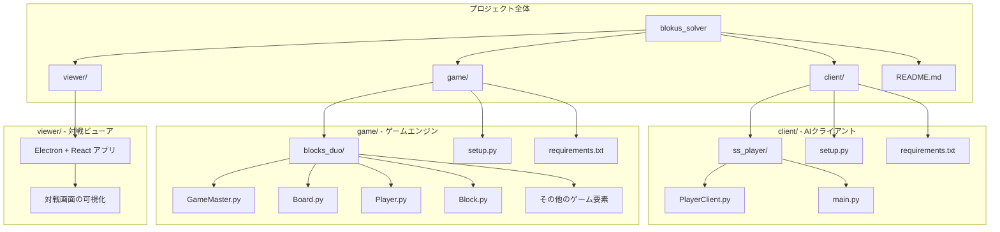

# Blokus Solver - ブロックス・デュオ AI 対戦システム

このプロジェクトは、SMART SCAPE CUP ハッカソンで開発された[ブロックス・デュオ](https://ja.wikipedia.org/wiki/%E3%83%96%E3%83%AD%E3%83%83%E3%82%AF%E3%82%B9)用AI対戦システムです。チーム「Penguin」によって開発され、ハッカソンで準優勝を果たしました。

## ハッカソン概要

### 開催日程
- **1日目（2024/5/24）**: 18:00-20:00 ブレイクアウトタイム
- **2日目（2024/5/25）**: 10:00-20:00 開発
- **3日目（2024/5/26）**: 10:00-15:00 トーナメント戦

### 戦略
相手の次の手を制限する「粘着戦略（Sticky Strategy）」を採用しました。相手が置けるブロックの場所を減らすことで、相手の行動を制限し、勝利を目指します。

## プロジェクト構成



### ディレクトリ構成

#### `/client` - AIクライアント
- **`ss_player/`**: Penguinチームが開発したAIプレイヤー
  - `PlayerClient.py`: WebSocketを介してゲームサーバーと通信
  - `main.py`: クライアントのエントリーポイント
- **`setup.py`**: パッケージ設定（コマンド: `sticky`）
- **`requirements.txt`**: Python依存関係

#### `/game` - ゲームエンジン（運営提供）
- **`blocks_duo/`**: ブロックス・デュオのゲームロジック
  - `GameMaster.py`: ゲーム進行管理
  - `Board.py`: ゲームボード状態管理
  - `Player.py`: プレイヤー抽象クラス
  - `Block.py`: ブロック要素の定義
  - その他のゲーム要素（回転、配置、勝敗判定など）
- **`setup.py`**: パッケージ設定（コマンド: `start_blocksduo`）

#### `/viewer` - 対戦ビューア（運営提供）
- **Electron + React**: ゲーム対戦の可視化アプリケーション
- **Material-UI**: UIコンポーネント
- **Express**: APIサーバー機能

## セットアップ

### 1. 仮想環境の作成
```bash
python3 -m venv ssvenv
source ssvenv/bin/activate
```

### 2. パッケージのインストール
```bash
pip install -U ./game
pip install -U ./client
```

インストール後の構成：
- **ゲーム本体**: `blocks_duo_ss` パッケージ
- **Penguinチーム AI**: `blocks_duo_Penguin` パッケージ（コマンド: `sticky`）

### 3. 対戦実行

#### 自作AI同士の対戦
```bash
start_blocksduo sticky sticky
# フォーマット: start_blocksduo {AI1の名前} {AI2の名前}
# Penguinチームが開発した粘着戦略AI同士での対戦
```

#### サンプルプレイヤーでのテスト
プロジェクトにはサンプルプレイヤー（`ss_tarou`）も含まれており、開発・テスト用に利用できます：
```bash
start_blocksduo ss_tarou ss_tarou
# サンプルプレイヤー同士での対戦（動作確認用）
```

## AI戦略の詳細

### 粘着戦略（Sticky Strategy）の実装プロセス
1. **合法手の列挙**: 反則でない手を「ok_cases」リストに格納
2. **粘着戦略の適用**: 相手の配置場所を制限する手を優先
3. **大きなブロックの優先**: より大きなブロックの配置を重視
4. **さらなる最適化**: 追加の戦略ルールを適用

### アルゴリズムの特徴
- WebSocket通信による非同期処理
- リアルタイムのゲーム状態分析
- 相手の行動を予測・制限する戦略的思考

## 成果

🏆 **SMART SCAPE CUP ハッカソン 準優勝**

詳細: [ニュースリンク](https://www.dreamnews.jp/press/0000299920/)

## 技術スタック

- **Python 3.8+**: メインの開発言語
- **WebSocket**: リアルタイム通信
- **NumPy**: 数値計算
- **Electron**: デスクトップアプリケーション
- **React + TypeScript**: フロントエンド
- **Material-UI**: UIコンポーネント

## 開発チーム

**チーム名**: Penguin
**開発者**: KaiMiyazawa（Penguin）